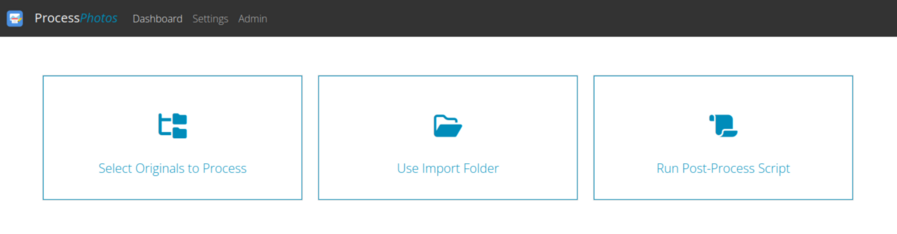
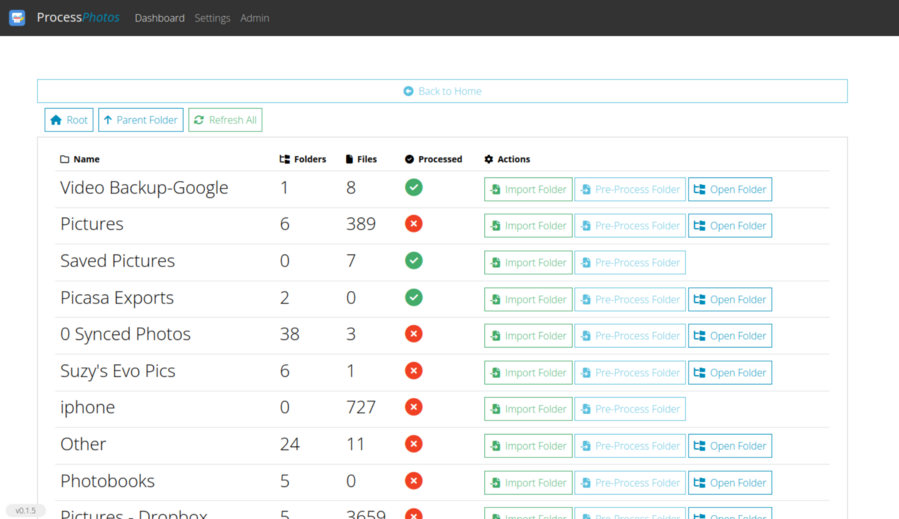
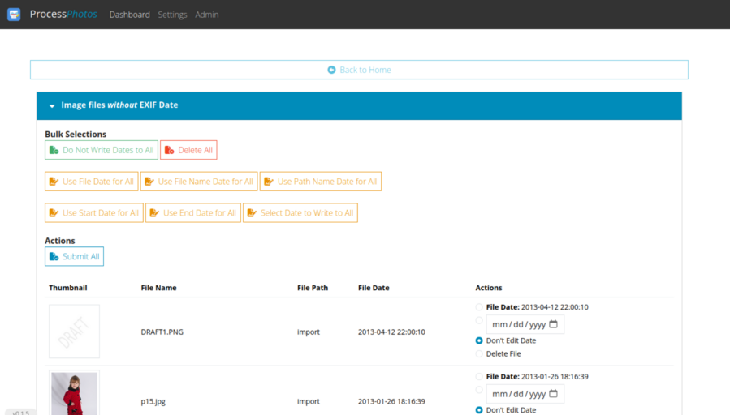
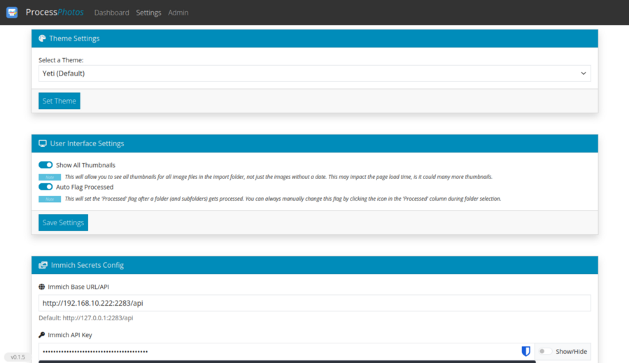

# Process Photos 

Takes all photos from import folder OR from originals folder (copied to the import folder by the tool), checks files to see if there is an exif date.  

If no exif date if found, then lists the photos along with possible guesses of the date (using filename, filepath, filedate).  Allows you to write the date to the files, etc.  Edited files are dumped into the export folder.  

## Install: 

Install the container, using the below docker compose format.

#### Docker Compose:

```docker
services:
  web:
    container_name: processphotos
    image: nebhead/processphotos
    ports:
      - "5086:5000"
    volumes:
      - /local/volume/import:/import
      - /local/volume/export:/export
      - /local/volume/originals:/originals
      - /home/user/docker/processphotos/config:/config
      - /home/user/docker/processphotos/logs:/logs
    environment:
      - FLASK_ENV=production
      - FLASK_DEBUG=0
    restart: unless-stopped 
```

## Usage

#### WebUI 

Go to the IP:Port assigned to the container in your web browser.  (i.e. http://192.168.1.100:5086)



On the main page, you can select:

1. **Select Originals to Process**
    
    This option allows you to select a folder from your 'originals' folder to process.  There will be an option to 'import' the folder which will copy the contents (including subfolders) to your import folder for processing.  There will be an option to 'pre-process' the folder which will run the pre-processing script prior to importing to the folder.  There may be an option to open the folder if it has sub-folders.  



2. **Use Import Folder**
   
    This option allows you to just use whatever is in the import folder for processing.  
3. **Run Post-Process Script**
    
    This option allows you to run the post-processing script to run post-process whatever is in the export folder. 

#### Processing



On this page, all image files that do not have any EXIF dates will be shown. Each will have options for modifying the EXIF date based on guessed data such as the file date, the file name, the folder name, etc. Can also select a custom date for files.  Actions can be done in bulk for the selected files.  You may also choose to delete the files in the export process.  

#### Scripts 

1. **Pre-process script**
   This script can be found at /config/preproc.sh and can be used to run other tools such as SortPhotos prior to running the analysis of the folder.  
2. **Post-process script**
   This script can be found at /config/postproc.sh and can be used to run other tools such as SortPhotos after processing changes to the import folder contents and exporting to the export folder.  Optionally this could be used to transfer files to some other image software, such as Immich.  The default post-process script has Immich support by uncommenting the indicated lines.  You may also need to configure the Immich secrets.yaml file with your base server url and the API key for your user.  

#### Settings 



In this section you can choose the app theme, ui options or immich export details.  

## Attributions

* Bootstrap - WebUI Based on Bootstrap 5. Bootstrap is released under the MIT license and is copyright 2018 Twitter. (https://getbootstrap.com)
* JQuery - Required by Bootstrap. Copyright JS Foundation and other contributors. Released under MIT license. (https://jquery.org/license)
* FontAwesome - Amazing FREE Icons that I use throughout this project. Copyright Font Awesome. Released under the Font Awesome Free License. (https://fontawesome.com)
* BootSwatch - Bootstrap CSS styling. Copyright 2012-2021 Thomas Park. Licensed under MIT. (https://bootswatch.com/)
* SortPhotos - SortPhotos is a Python script that organizes photos and videos into folders using date/time information from EXIF data. Copyright 2013, S. Andrew Ning. Licensed under MIT. (https://github.com/andrewning/sortphotos)
* Exiftool - Exiftool is an excellent EXIF data scraping tool, used by SortPhotos. Copyright Phil Harvey. Licensed as Perl Licensing. (https://exiftool.org/)
